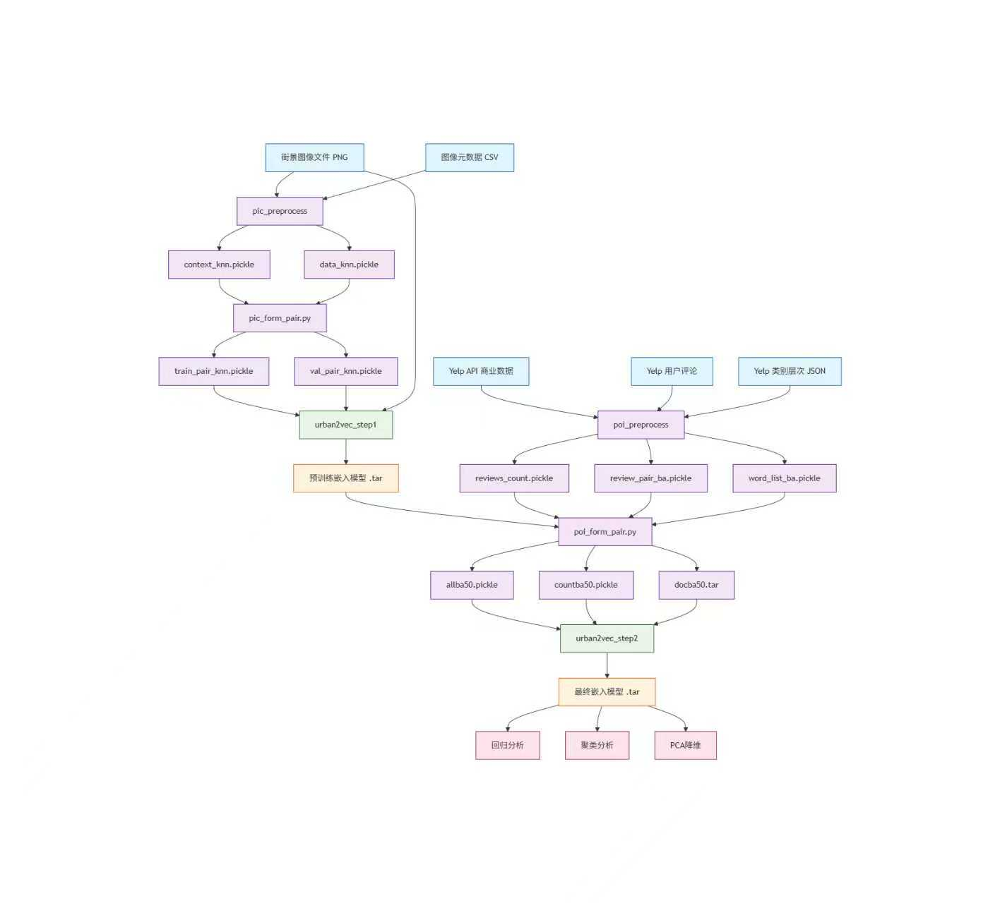

# Urban2Vec 数据流全景图

## 整体数据流程概览


## 详细阶段分解

### 阶段1：街景图像数据预处理

#### **输入文件**
| 文件类型 | 格式 | 内容说明 |
|---------|------|---------|
| 街景图像 | PNG文件 | 存储在`meta_data/image_meta/`子目录中，命名如`0/12345.png` |
| 图像元数据 | CSV文件 | 每个图像对应一行，包含：<br>• 文件名<br>• 经纬度坐标<br>• 人口普查区编号（census tract fips）<br>• 其他图像属性 |

#### **处理脚本**：`pic_preprocess/pic_form_context.py`
- **功能**：基于地理距离构建图像上下文关系
- **算法**：对每个图像，计算与所有其他图像的球面距离，选择最近的6个邻居（k=6）
- **输出**：
  - `context_knn.pickle`：字典，键=图像路径，值=[最近邻图像路径列表]
  - `data_knn.pickle`：列表，元素为`[图像路径, 纬度, 经度, 人口普查区]`

#### **处理脚本**：`pic_preprocess/pic_form_pair.py`
- **功能**：生成训练/验证图像对
- **输入**：`context_knn.pickle`, `data_knn.pickle`
- **处理**：
  1. 构建双向上下文关系
  2. 随机划分训练集（50,000图像）和验证集（剩余图像）
  3. 生成锚点-正样本对（来自同一上下文的图像）
  4. 采样生成固定数量的训练/验证对
- **输出**：
  - `train_pair_knn.pickle`：100,000个训练对，格式`[锚点图像路径, 正样本图像路径, 人口普查区]`
  - `val_pair_knn.pickle`：20,000个验证对，格式同上

---

### 阶段2：POI数据预处理

#### **数据爬取脚本**：`poi_preprocess/poi_crawl_data.py`
- **功能**：通过Yelp Fusion API获取商业数据和用户评论
- **输出**：
  - `reviews{count}.pickle`：按商家汇总的评论数据
  - `error{count}.pickle`：爬取出错的商家列表
  - `unfinished{count}.pickle`：未完成的爬取任务

#### **文本处理脚本**：`poi_preprocess/review_form_pair.py`
- **输入**：
  - `street_view_ba.pickle`：包含人口普查区列表
  - `census_tract_business_dict_ba.pickle`：人口普查区到商家映射
  - `reviews84448.pickle`：原始评论数据
  - `stop_word.txt`：停用词列表
- **处理**：
  1. 分词、去除停用词、过滤短词
  2. 统计词频，筛选出现次数在6-1500之间的词
  3. 构建词-人口普查区对
- **输出**：
  - `review_pair_ba.pickle`：词-人口普查区对列表
  - `word_list_ba.pickle`：筛选后的词表

#### **POI整合脚本**：`poi_preprocess/poi_form_pair.py`
- **输入**：
  - `word_list_ba.pickle`：词表
  - `street_view_ba50.pickle`：阶段1训练的街景嵌入
  - `census_tract_business_dict_ba.pickle`：商业数据字典
  - `categories.json`：Yelp类别层次结构
  - `review_pair_ba.pickle`：评论词对
- **处理**：
  1. 加载GloVe词向量，初始化未登录词
  2. 提取商家属性（价格等级、评分、类别）
  3. 递归扩展类别层次（如"restaurants" → "food" → "businesses"）
  4. 过滤低频类别（出现次数<5）
  5. 合并评论词和POI属性词
  6. 构建词-地点索引映射
- **输出**：
  - `docba50.tar`：PyTorch检查点，包含：
    - `place_embedding.weight`：预训练的地点嵌入矩阵
    - `word_embedding.weight`：GloVe初始化的词嵌入矩阵
  - `allba50.pickle`：字典，包含：
    - `id`：地点ID到词列表的映射 `{place_id: [word_id1, word_id2, ...]}`
    - `word`：词-地点对列表 `[[word_id, place_id], ...]`
  - `countba50.pickle`：词频统计数组
  - `tonumba50.pickle`：索引映射字典 `{'word': word2num, 'id': id2num}`

---

### 阶段3：街景图像嵌入训练（Step 1）

#### **训练脚本**：`urban2vec_step1/train_place_embedding.py`
- **输入**：
  - 原始PNG图像文件
  - `train_pair_knn.pickle`：训练图像对
  - `val_pair_knn.pickle`：验证图像对
- **数据加载**：`PlaceImagePairDataset`
  - 返回：`(anchor_image, positive_image, fips)`
- **模型架构**：`PlaceImageSkipGram`
  - 修改的Inception3 → 2048维特征 → 线性层 → 目标嵌入维度（默认50）
- **损失函数**：`MarginRankingLoss(margin=5)`
  - 计算：`loss(distance(anchor, negative), distance(anchor, positive), target=1)`
  - 距离度量：`PairwiseDistance(p=2)`（欧氏距离）
- **输出**：
  - 训练好的模型检查点（`.tar`文件）
  - 训练日志文件

---

### 阶段4：POI增强嵌入训练（Step 2）

#### **训练脚本**：`urban2vec_step2/train_place_embedding.py`
- **输入**：
  - `allba50.pickle`：词-地点对数据
  - `countba50.pickle`：词频统计
  - `docba50.tar`：预训练嵌入初始化
- **数据加载**：`PlacePairDataset`
  - 负采样策略：基于词频的幂律分布采样
  - 返回：`(place_index, positive_word_index, negative_word_index)`
- **模型架构**（两种变体）：
  1. `PlaceSkipGram`：点积相似度 + Sigmoid
     ```python
     score = sigmoid(sum(place_emb * word_emb))
     ```
  2. `PlaceSkipGrammargin`：欧氏距离（默认使用）
     ```python
     score = pairwise_distance(place_emb, word_emb, p=2)
     ```
- **损失函数**：`MarginRankingLoss(margin=2)`
  - 比较正样本对和负样本对的分数
- **训练策略**：
  - 加载阶段1的预训练嵌入（`strict=False`）
  - **全参数微调**（无冻结）
  - 优化器：Adam with amsgrad
- **输出**：
  - 最终的多模态嵌入模型
  - 统一的邻域表示（融合视觉和POI信息）

---

### 阶段5：分析与评估

#### **街景分析**：`pic_analysis/pic_regression.py`
- **输入**：训练好的嵌入 + 人口普查统计数据
- **任务**：线性回归预测社会经济指标
- **指标**：R²分数、均方误差

#### **POI分析**：`poi_analysis/`
- `poi_cluster.py`：基于嵌入的邻域聚类
- `poi_demo_regression.py`：人口统计学回归
- `poi_other_regression.py`：其他回归任务

#### **维度分析**：`dimension_correlation/pca1.py`
- **功能**：PCA降维和可视化
- **输出**：高维嵌入的2D/3D投影，展示邻域语义空间结构

---

## 关键数据格式总结

| 文件类型 | 格式 | 用途 | 生成阶段 |
|---------|------|------|---------|
| `*.pickle` | Python pickle | 中间数据序列化 | 所有预处理阶段 |
| `*.tar` | PyTorch检查点 | 模型参数保存 | 训练阶段 |
| `*.png` | 图像文件 | 街景图像原始数据 | 数据采集 |
| `*.csv` | CSV表格 | 图像元数据 | 数据采集 |
| `*.json` | JSON文件 | Yelp类别层次 | POI预处理 |

## 数据流特点

1. **两阶段训练**：先视觉后文本，逐步融合多模态信息
2. **基于地理的相似性**：图像上下文基于空间距离构建
3. **负采样策略**：
   - Step 1：随机打乱构造负样本
   - Step 2：基于词频的幂律分布采样
4. **嵌入融合**：阶段1的视觉嵌入作为阶段2的初始化，实现平滑过渡
5. **多任务评估**：通过回归、聚类、降维等多种方式验证嵌入质量

这个数据流程体现了论文核心思想：**通过对比学习融合街景视觉特征和POI语义信息，学习具有解释性的城市邻域嵌入**。